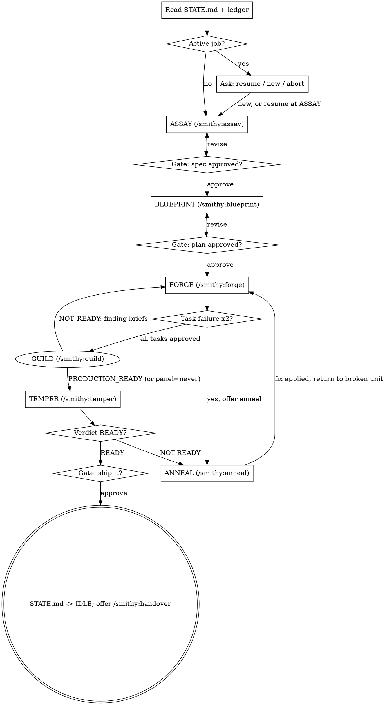

# Smithy — Pipeline Orchestrator

Read `${CLAUDE_PLUGIN_ROOT}/references/creed.md` and `${CLAUDE_PLUGIN_ROOT}/references/memory.md` first.
If `docs/smithy/` is missing, run `bash ${CLAUDE_PLUGIN_ROOT}/scripts/init-memory.sh`.

**You orchestrate. You never do phase work yourself.** Each phase runs by
invoking that phase's skill; you read back only status lines, artifact paths,
and short summaries. Never paste artifact contents into your context.

## Checklist (create a todo per item)

1. Read STATE.md + ledger; resolve resume-vs-new with the user
2. Run each phase via its skill, in state-machine order
3. Gate at every phase boundary (present → ask → log)
4. Route failures through ANNEAL, back to the exact broken unit
5. Exit: TEMPER READY + final gate → STATE.md idle → offer handover

## Process flow

(ANNEAL exiting from a TEMPER failure re-runs ONLY the failing suite, then
re-consolidates — not the whole TEMPER phase.)

GUILD (`/smithy:guild`) is the production-readiness persona panel. It runs
when the `review_panel` config is `auto` or `always` and is skipped when
`never`. NOT_READY routes finding briefs back to FORGE; after fixes, only
the personas that raised findings re-run. GUILD has no user gate of its own —
its verdict feeds the flow; Medium/Low deferrals need explicit user
acceptance recorded in decisions.md.

## Entry: resume or start

1. Read `docs/smithy/STATE.md` and `bash ${CLAUDE_PLUGIN_ROOT}/scripts/ledger.sh tail 30`.
2. If STATE.md shows an active job, AskUserQuestion: **Resume** at the
   recorded position (say exactly where: phase + unit + next action) or
   **Start new** (the old job stays on disk) or **Abort old job** (STATE.md
   → IDLE, ledger notes the abort).
3. Resume rule: recompute position from the LEDGER, not recollection — the
   first unit without a `DONE`/`APPROVED`/`PASS` line is where work resumes.
   Cross-check `git log --oneline <base>..HEAD` when a base sha exists, and
   scan the job's `reports/` dir for artifacts the ledger missed (a crashed
   session may have produced work it never logged).

## Gates

At each `[gate]` (skipped only if `gates.pause_between_phases` is false in
the effective config):

1. Present: the phase's artifact path + a ≤5-line summary + what the next
   phase will do + any concerns carried forward.
2. AskUserQuestion: **Approve** (continue) / **Revise** (re-run the phase
   with the user's feedback appended to its input) / **Abort** (update
   STATE.md, stop cleanly).
3. Log: `ledger.sh append gate <slug> <phase> <APPROVED|REJECTED> <artifact>`
   and update STATE.md (phase, next step) — the gate line is what resume
   trusts, so it is written BEFORE announcing the next phase.
4. **The BLUEPRINT gate carries commit authorization.** When presenting it,
   say so explicitly: "Approving this plan authorizes its task commits."
   On approval run `bash ${CLAUDE_PLUGIN_ROOT}/scripts/guard.sh grant <slug>`;
   the guard hook blocks agent commits without it. At job end (Exit) run
   `guard.sh revoke`. Push is NEVER granted here — a push needs its own live
   user yes, then `guard.sh allow-push-once`.

FORGE's per-task inspect verdicts are internal — no user gate per task. Two
REJECTED cycles on one task escalates to the user (that escalation is not a
gate; it's a blocking question).

## Failure routing

- FORGE task fails verify or review twice → offer ANNEAL on the failing
  report before any third attempt.
- TEMPER returns NOT READY → offer ANNEAL with the failing suite's report;
  after the fix lands (via jig/forge), re-run ONLY the failing suite, then
  re-consolidate the temper summary.
- ANNEAL exits → return to the exact unit that broke, not the phase start.
- The user rejects a gate twice → stop and ask what outcome they actually
  want; don't loop the phase a third time on the same feedback.

## Red flags — these thoughts mean STOP

| Thought | Reality |
|---|---|
| "I'll just do this phase inline, dispatching is overhead" | Inline phase work floods orchestrator context — the exact failure mode this design isolates. Invoke the skill. |
| "I remember where we were, skip the ledger read" | Recollection dies at compaction. The ledger is one command. Read it. |
| "The user approved the last three gates, skip this one" | Approval fatigue is real, but silent skipping breaks the audit trail. Present it compactly instead. |
| "I'll summarize the spec into my context for convenience" | That summary lives in your context forever. Paths + 5 lines, no more. |
| "TEMPER failed on a flake, just rerun until green" | Rerun-until-green launders flakes into passes. Route it through ANNEAL. |

## Context discipline

- After each gate on large jobs, recommend the user `/clear` — the ledger
  and STATE.md carry everything forward; resume is lossless by design.
- If you notice your context bloating mid-FORGE, say so and recommend
  clearing at the next task boundary.

## Exit

TEMPER verdict READY + final gate approved → run
`bash ${CLAUDE_PLUGIN_ROOT}/scripts/guard.sh revoke` (commit authorization
ends with the job), update STATE.md (Phase: IDLE, next step: none), then
offer `/smithy:handover`.
